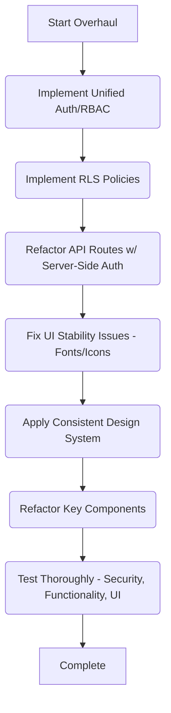

# Juna Application Overhaul Plan

## 1. Introduction

This document outlines the plan to overhaul the Juna web application, addressing critical security vulnerabilities, flawed user role separation, UI/UX inconsistencies, and insecure client-side operations. The primary objective is a complete revamp focusing on security, privacy, stability, and consistency through best practices, leveraging Supabase, OpenAI, and Vercel.

## 2. Problem Statement

*   **Flawed Auth/Role Separation:** Current User and Admin authentication flows are intertwined, using separate mechanisms (Supabase Auth + custom context for users, separate service + cookie for admins), leading to potential UI conflicts (e.g., mixed headers) and authorization bypass risks. Admin login is initiated from the standard user header.
*   **Missing Server-Side Authorization:** Key API routes (`/api/entry`, `/api/insights`) trust client-provided `userId` parameters without server-side verification, allowing potential unauthorized access to other users' data.
*   **Incomplete Row Level Security (RLS):** RLS is correctly implemented for `user_profiles` but is missing or unverified for most other tables, including `journal_entries`, `clinical_profiles` tables, `admin_users`, and `prompts` tables, posing significant data exposure and modification risks.
*   **UI Instability:** Reports of intermittently disappearing fonts and navigation icons indicate potential issues with CSS, theme switching, component rendering, or hydration.
*   **UI Inconsistency:** The look and feel across different application sections (e.g., public site, user areas, admin areas) need unification based on the established design in the `/journal/**` routes.
*   **Potential Insecure Client-Side Logic:** While initial checks didn't find direct SDK usage, the vulnerable API routes indicate a pattern of insufficient server-side validation that needs correction.

## 3. Goals

*   Implement distinct, secure, and unified authentication and authorization for 'User' and 'Admin' roles.
*   Enforce strict Role-Based Access Control (RBAC) and Row Level Security (RLS) across the application.
*   Migrate any sensitive logic or direct external API calls from the client-side to secure backend functions (API Routes or Edge Functions).
*   Diagnose and fix UI stability issues (fonts/icons).
*   Establish and enforce a consistent design system across the entire application.
*   Refactor critical codebase sections for improved security, maintainability, and performance.

## 4. Proposed Solution

### 4.1. Auth/RBAC Strategy

*   **Unified Auth State:** Rely *only* on the standard Supabase session (`supabase.auth`) for authentication for all users (regular and admin). Remove the separate `admin_session` cookie mechanism and `AdminAuthService`'s reliance on it for session checking.
*   **Role Management:** Introduce a `user_roles` table linked to `auth.users.id` (or utilize Supabase custom claims). This table/claim will store roles (e.g., 'user', 'admin', 'super_admin').
*   **Server-Side Role Check:** Create a reusable server-side helper function (e.g., `getUserRole(request)`) that uses an authenticated Supabase client (from `@supabase/ssr` or helpers) to get the current user's ID and look up their role from the `user_roles` table/claims.
*   **API Authorization:** All API routes must:
    *   Instantiate an authenticated server-side Supabase client.
    *   Get the requesting user's ID and role using the helper function.
    *   Perform checks:
        *   Is the user authenticated?
        *   Does the user have the required role (e.g., 'admin' for admin routes)?
        *   For data access, does the authenticated user ID match the target `userId` (for user data), OR does the user have an admin role permitting access (based on defined privileges)?
*   **UI Rendering & Flow:**
    *   Use Server Components where possible to fetch data and roles server-side, conditionally rendering UI elements based on role.
    *   For client components needing role-specific UI, fetch the role securely via a dedicated API endpoint that uses the server-side helper.
    *   Remove the admin login trigger from the main user header (`components/header.tsx`).
    *   Create a dedicated admin login page (`/admin/login`) that uses the standard `signIn` mechanism but verifies the user's role from the `user_roles` table/claims upon successful authentication before granting access to admin sections.
    *   Refactor `AdminAuthService` to use the unified session and role checking mechanism.

### 4.2. Row Level Security (RLS)

*   Enable RLS on *all* tables containing user data or sensitive config (`journal_entries`, `clinical_profiles`, `mental_health_domains`, `profile_tags`, `growth_milestones`, `linked_evidence`, `admin_users`, `prompts`, `prompt_versions`, `prompt_usage`, `prompt_test_results`, `entry_tags`, `entry_categories`, etc.).
*   Define policies:
    *   **User Data Tables** (`journal_entries`, `clinical_profiles`, etc.):
        *   `SELECT/UPDATE/DELETE`: `USING (auth.uid() = user_id)` for users.
        *   Consider admin access policies carefully, potentially using a `SECURITY DEFINER` function to check roles (e.g., `USING (is_current_user_admin())`).
    *   **Admin/Config Tables** (`admin_users`, `prompts`, etc.):
        *   `SELECT/INSERT/UPDATE/DELETE`: `USING (is_current_user_admin())` (requires a helper function `is_current_user_admin` callable within RLS, likely a `SECURITY DEFINER` function checking the `user_roles` table/claims against `auth.uid()`).
        *   Deny access by default.

### 4.3. Backend Migration / API Refactoring

*   Refactor `/api/entry`, `/api/insights`, and all other API routes handling data access or mutations to:
    *   Use server-side authenticated Supabase clients (`@supabase/ssr` or helpers).
    *   Implement strict server-side authorization checks based on the authenticated user's ID and role *before* executing database queries or mutations.
    *   Remove reliance on client-provided `userId` for authorization decisions.
*   Utilize Supabase Edge Functions for logic requiring specific secrets or computationally intensive background tasks. Standard Next.js API Routes are suitable for most data fetching/mutation if properly secured.

### 4.4. UI/UX Stabilization & Design System

*   **Font/Icon Issue:** During implementation, systematically debug potential causes: CSS conflicts (especially around theme classes), component rendering logic (conditional rendering, keys), hydration mismatches (`suppressHydrationWarning`), and theme switching implementation (`next-themes`).
*   **Design System:**
    *   Establish the styles from `/journal/**` as the baseline (typography, colors defined in `globals.css` variables, spacing, component styles).
    *   Apply these styles consistently across all sections (`app/`, `components/`, `/admin/**`).
    *   Refactor base UI components (`components/ui/`) as needed to ensure consistency and alignment with the design system. Update `tailwind.config.ts` and `globals.css` accordingly.

### 4.5. Refactoring Approach

*   Prioritize refactoring components and services involved in:
    *   Authentication and authorization (`AuthContext`, `AdminAuthService`, login pages, headers).
    *   API route handlers (`/api/**`).
    *   Components displaying sensitive data or interacting with vulnerable APIs.
*   Address V0-generated code or other areas identified as needing improvement for clarity, security, and maintainability during the implementation phase.

## 5. Implementation Plan (High-Level Flow)

## 6. Success Criteria

*   User and Admin roles are completely segregated with no UI or data leakage.
*   All sensitive operations and data access are protected by server-side authorization checks and robust RLS policies.
*   Client-side logic does not handle sensitive data or make direct external API calls insecurely.
*   UI stability issues (fonts/icons) are resolved.
*   A consistent design system is applied across the entire application.
*   The application is stable, secure, and maintainable.